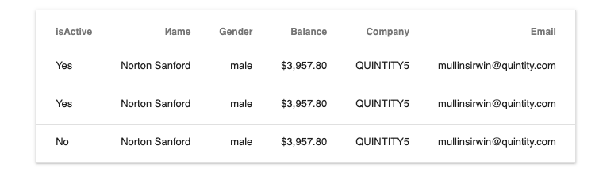

# Тестовое задание для Frontend-разработчика

Необходимо создать SPA в котором будем загружаться данные из файла list.json. 
Данные из файла необходимо отобразить в виде таблицы с 

- В таблице должно выводиться по только 25 элементов
- Необходима возможность пагинации данных средствами фронта
- Использовать тэги table, td, tr, th - запрещено
- Максимальная ширина таблицы - 1000px, она должна находится всегда посередине страницы
- Необходимо предусмотреть мобильную версию верстки таблицы
- Ниже отобразить используя любую библиотеку график возрастов из списка
- Для стилей предпочтительно использовать css-перепроцессоры
- Для получения данных можно использовать любую библиотеку
- Использование фреймворков на ваше усмотрение 
